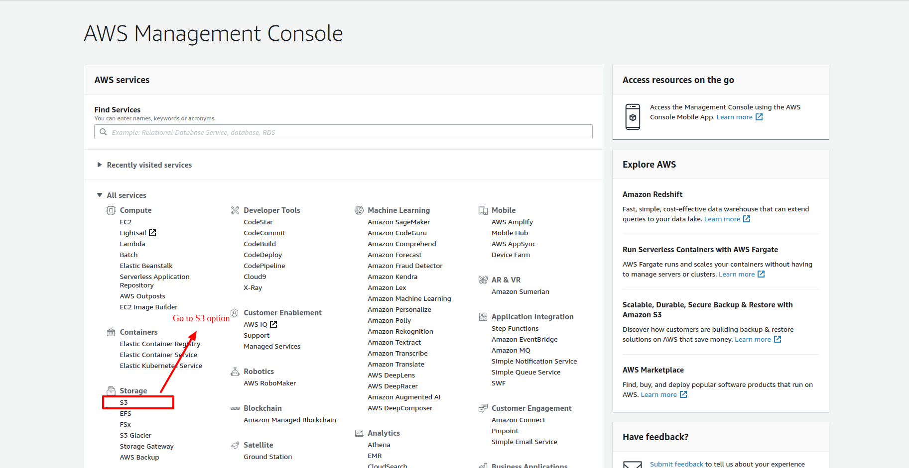
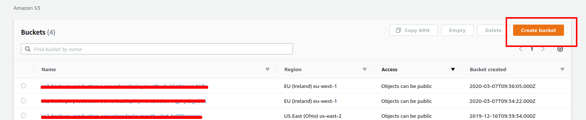
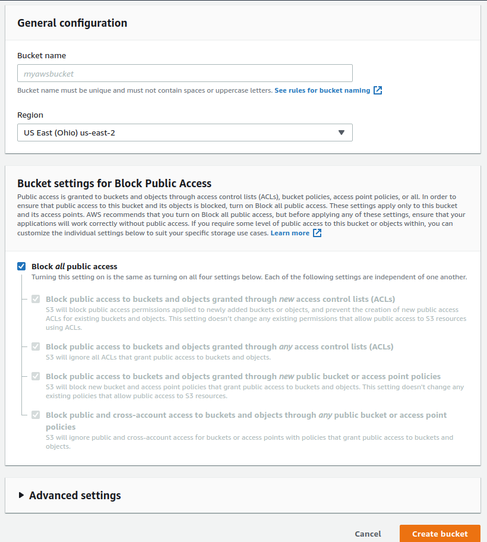
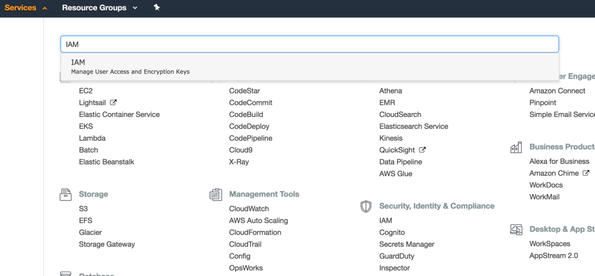
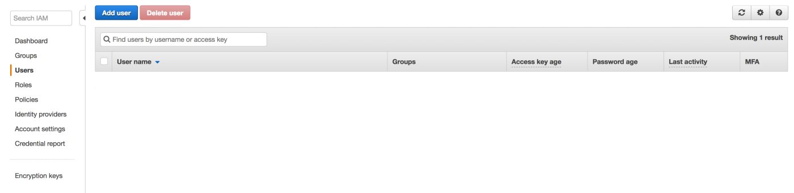
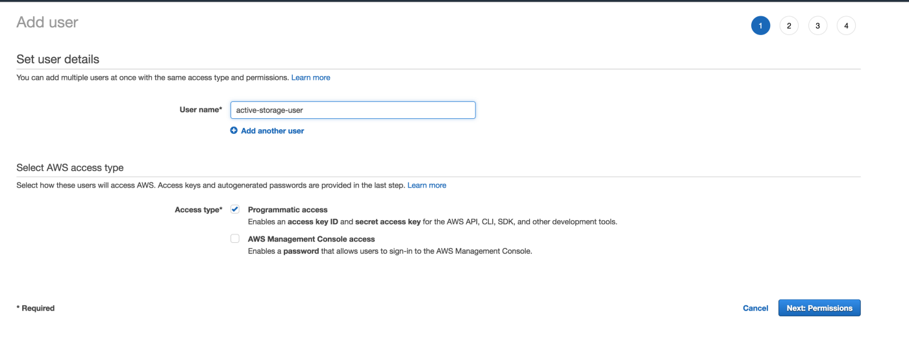
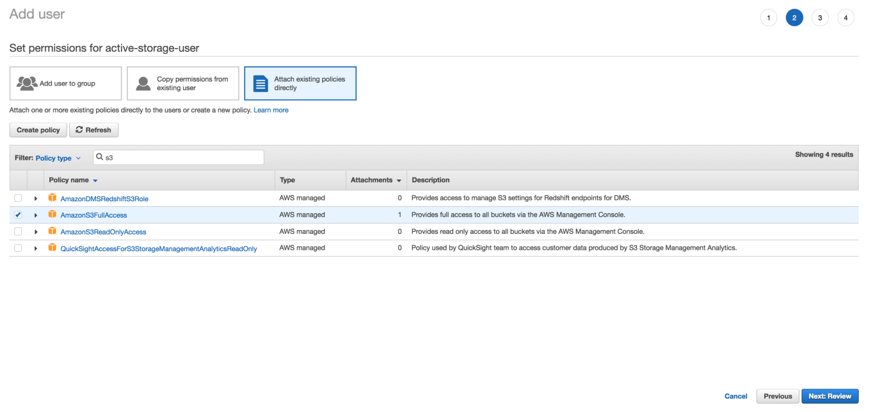
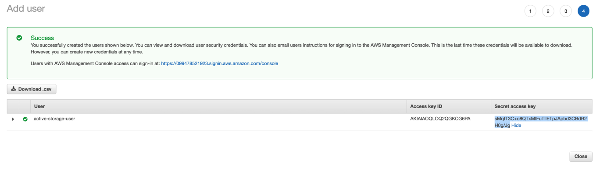

# Setting-up-Rails-5-Active-Storage-with-Amazon-S3

## Creating the Aws S3 bucket

- First you need to create or login with existing AWS account and go for your S3 management
- After Successfully login, Click on S3 option to create the S3 bucket


- Click on the service and should get a screen like this with list of buckets(if you already have) otherwise an empty list of buckets:



- Add the Bucket name and select the appropriate region of bucket then you could go with **Create Bucket**

- After creating the bucket you'll see the name of you bucket in Bucket list

## Adding user policy to grant access to files
- Now we are going to create an user and give him the necessary permissions to have read/write access to the S3 Bucket.
- Let’s click on Services and search for IAM:

- On the IAM service page click on Users and there click on Add User:

- In the Add User screen type in a User name and **be sure to check the Programmatic access checkbox y Access type section**.

- After that we must assign the S3 Policy Access in the next screen:

-Click on Attach Existing policies directly and search for S3 policies and select AmazonS3FullAccess and click on Next: Review.
- On the review screen click on Show in Secret access key column to see the value. Store both of these values: Access key ID and Secret access key in a safe place because we are going to need it to setup Active Storage on Rails later.



# Rails Setup

## config/storage.yml
```
test:
  service: Disk
  root: <%= Rails.root.join("tmp/storage") %>

local:
  service: Disk
  root: <%= Rails.root.join("storage") %>

# Use rails credentials:edit to set the AWS secrets (as aws:access_key_id|secret_access_key)
amazon:
  service: S3
  access_key_id: ENV["access_key_id"]
  secret_access_key: ENV["secret_access_key"]
  region: "us-east-2"
  bucket: "your-bucket-name" 
```
  
  For app running on localhost:
  In config/environments/development.rb
  ``` config.active_storage.service = :local ```
  
  ### For Production and Staging (config/environments/production.rb):
  ```config.active_storage.service = :amazon ```
### Add the aws-sdk-s3 gem to your Gemfile:
```
.
.
gem "aws-sdk-s3", require: false
.
.
```
